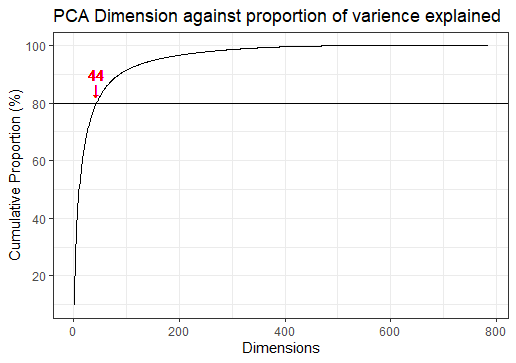
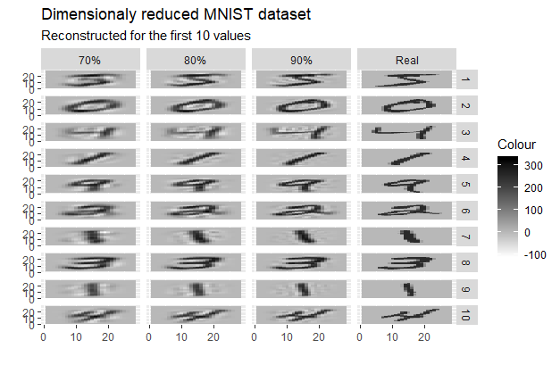

```{r setup, include=FALSE}
knitr::opts_chunk$set(echo = TRUE)
```


# Introduction to Machine Learning: MNIST written character classification
1.1 

We can use machine learning to help solve many different types of problems. One problem machine learning can be useful in solving is the classification problem. This is the problem of identifying which set of categories a new observation belongs to. This has many useful applications in the real world such as classifying emails as either spam, or not spam. 


1.2 

In order to classify new observations you need to use a supervised learning algorithm. This is where we use a training dataset to learn the relationship between the variables and our label before applying this relationship (algorithm) to the new observations. When we're creating our supervised learning algorithm we split our dataset up into a training dataset and a test dataset. We seperate the data then we have one dataset to train/build our algorithm and another so we can test our model. It is important that we don't train our model on test data becuase this will cause bias in our testing and will artifially increase the accuracy of our test. It is also good practice to make sure that the training dataset covers the edges of each dimension, this improves our model as we aren't extrapolating outside of our known model domain. We also check the distribution of classifications in each dataset, it is important that the distribution of these datasets are different, this gives us confidences in our test results and shows are model generalises well to unseen data. In practise we would normally split our data up into 70% training and 30% test data. This is to ensure we have a large dataset to train our model and still have a sufficient amount data left to test our model. 

1.3 

The MNIST dataset contains information on handwritten digits from 0-9. Each digit is stored as an individual 28x28 matrix where each element is scaled between 0 and 255, where 0 indicates a blank square (no hand writing) and 255 is a filled square (hand writing). This is a useful dataset where the classification problems comes into play. Here we have 784 (28^2) variables which we can classify as one of 10 labels (0-9). The dataset is also quite large at 60,000 observations which means we can have a good sized training and test dataset which allows us to build and sufficiently test our model.

2.

Due to the size of the dataset it can take a long time to perform analysis on the dataset. This is partly due to the large number of variables. To speed up and make analysis on this dataset viable we can apply dimension reduction. This is where we reduce the number of variables (dimensions) to increase the speed of computation. The aim is to reduce the number of variables whilst maintaining or keeping as much variation in the data as possible. We are going to reduce the dimensions using Principal Componant Analysis (PCA). This is where we orthogonally transform our data based on eigen-vectors. This is set out so the first few principal componants contain most of the variation (information) and the later principal componants contain the least variation. This allows us to reduce the dimensions to the first n variables (dimensions) without loosing much variation (information). When performing PCA we have options to scale and center are PC coordinates. Centering moves your coordinates from the origin to the center of the centroid, this doesn't change the analysis but it can make it easier to understand your new PCA dataset. For this reason we have centered are PCA on the MNIST dataset. Scaling can alter your analysis quite a lot. Scaling normalises the distances between the dimensions, by streching the dimensions. This can be useful when your dimensions very wildly. For instance if one dimension varies between 0-5 and another dimension varies between 0-100, if you don't scale the axises the smaller axis will be underepresented and it will put more emphasis on the larger dimension for your categorisation. But by scaling the axis you can give equal important to each dimension. The general concensus is that you want your principal componants to contain at least 80% of the variation in the data but this may be higher. 


Above we can see when we plot the cumulative proportion of varience explained against dimensions that we need 44 dimensions to explain 80% of the variance. To get a get balance between number of dimensions and porportion of variance explain it is often a good balance to go for the "elbow" of the curve, we can see on the plot above this is around 90% of 87 dimensions (see chart below).

| % of variance explained | 70%  | 80%  | 90% |
| ------------- |:-------------:| :-----:| --------:|
| Number of dimensions| 26 | 44 | 87 |


PCA is reversible (through matrix multipulcation see R code) which allows us to go back from our reduced dimension dataset back to our orginal matrix. This can be very useful in seeing the affects reducing our dimensions has. As you can see below we have test 3 different dimension reduced datasets (70%, 80% and 90% of variance explained) and compared them to the orginal.


As you can see from the plot above the pictures hold up well as we reduce the amount of variance explained. At 70% the digits starts becoming too blurred to tell digits apart, but at 80% the digits looks similar to the orginal. When using the 80% dataset we have reduced the number of variables from 784 to 44 whilst getting a similar level of detail. This massively reduces the amount of computation power and storage need for us to perform our analysis.
