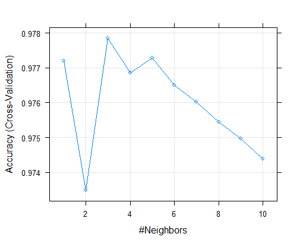
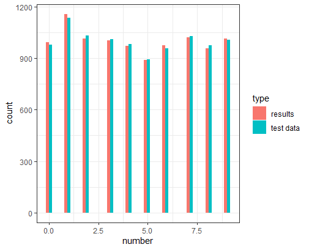

```{r setup, include=FALSE}
knitr::opts_chunk$set(echo = TRUE)
```


# Introduction to Machine Learning: MNIST written character classification
1.1 

We can use machine learning to help solve many different types of problems. One problem machine learning can be useful in solving is the classification problem. This is the problem of identifying which set of categories a new observation belongs to. This has many useful applications in the real world such as classifying emails as either spam, or not spam. Classification is a problem in supervised learning, this is where we have training dataset **x** which corresponds to a set of outputs **t** (our classifications). Our dataset **x** is usually made up of many variables/ dimensions D, which is used to map to our outputs. We then learn a function to go from our data **x** to our target y(**x**)=**t**. We can then use this function with new test data to predict our new output. You wouldn't normally use unsupervised learning to help solve a classification problem, as unsupervised learning techniques clusters similar observations. In some circumstances you could manually classify the clusters but this isn't always recommonded as the algorithm may be clustering on different features of the data than what you are expecting. 


1.2 

When it comes to creating our model it is standard practice to split our data up into a training and testing datasets. The training dataset is used to train our model, then we use our test dataset to see how good are model is. Splitting the data allows us fairly test our model and help reduce the risk of overfitting. This is where we fit the model exactly to the data instead of the features in the data. Using a training and test dataset is used in both supervised and unsupervised machine learning. and there are a few keys things to be aware of when making our datasets. Firstly it's important that we don't train our model on test data as this will cause bias when testing our model and may cause overfitting and artifially increase the accuracy of our test. It is also good practice to make sure that the training dataset covers the edges of each dimension, this improves our model as we aren't extrapolating outside of our known model domain. In practise we would normally split our data up into 70% training and 30% test data. This is to ensure we have a large dataset to train our model and still have a sufficient amount data left to test our model. When it comes to classification and supervised learning we use the training dataset to learn the relationship between variables (**x**) and our labels (**t**), then we test how accurate the model on the test data. It is a good idea to check the distribution of the labels (**t**) with the training and test data, this is to ensure that your are modelling on different data and that you're testing all classifications. 

1.3 

The MNIST dataset contains information on handwritten digits from 0-9. Each digit is stored as an individual 28x28 matrix where each element is scaled between 0 and 255, where 0 indicates a blank square (no hand writing) and 255 is a filled square (hand writing). This is a useful dataset where the classification problem comes into play. Here we have 784 (28^2) variables which we can classify as one of 10 labels (0-9). The dataset is also quite large at 60,000 observations which means we can have a good sized training and test dataset which allows us to build and sufficiently test our model.

2.

Due to the size of the dataset it can take a long time to perform analysis on the dataset. This is partly due to the large number of variables. To speed up and make analysis on this dataset viable we can apply dimension reduction. This is where we reduce the number of variables (dimensions) to increase the speed of computation. The aim is to reduce the number of variables whilst maintaining or keeping as much variation in the data as possible. We are going to reduce the dimensions using Principal Component Analysis (PCA). This is where we orthogonally transform our data based on eigen-vectors. This is set out so the first few principal components contain most of the variation (information) and the later principal components contain the least variation. This allows us to reduce the dimensions to the first n variables (dimensions) without losing much variation (information). When performing PCA we have options to scale and center our PC coordinates. Centering moves your coordinates from the origin to the center of the centroid, this doesn't change the analysis but it can make it easier to understand your new PCA dataset. For this reason we have centered ourare PCA on the MNIST dataset. Scaling can alter your analysis quite a lot. Scaling normalises the distances between the dimensions, by stretching the dimensions. This can be useful when your dimensions vary wildly. For instance if one dimension varies between 0-5 and another dimension varies between 0-100, if you don't scale the axises the smaller axis will be underepresented and it will put more emphasis on the larger dimension for your categorisation. But by scaling the axis you can give equal importance to each dimension. The general concensus is that you want your principal components to contain at least 80% of the variation in the data but this may be higher. 
## Add a 90% one as well and maybe a non_cumulative line to show the elbow..
 

Above we can see when we plot the cumulative proportion of variance explained against dimensions that we need 44 dimensions to explain 80% of the variance. To get a balance between number of dimensions and proportion of variance explained, it is often a good balance to go for the "elbow" of the curve. We can see on the plot above this is around 90% or 87 dimensions (see chart below).

| % of variance explained | 70%  | 80%  | 90% |
| ------------- |:-------------:| :-----:| --------:|
| Number of dimensions| 26 | 44 | 87 |


PCA is reversible (through matrix multiplication see R code) which allows us to go from our reduced dimension dataset back to our original matrix. This can be very useful in seeing the affects reducing our dimensions has. As you can see below we have tested 3 different dimension reduced datasets (70%, 80% and 90% of variance explained) and compared them to the original.
## change the % to % and number of dimensions, also take the axises away from the graphs


As you can see from the plot above the pictures hold up well as we reduce the amount of variance explained. At 70% the digits start becoming too blurred to tell digits apart, but at 80% the digits look similar to the original. When using the 80% dataset we have reduced the number of variables from 784 to 44 whilst getting a similar level of detail. This massively reduces the amount of computational power and storage needed for us to perform our analysis.

3. ## Need to add graph about overfitting vs 

Now we have reduced the dimensions of our dataset, we are now able to start analying/creating our model. We are going to be performing K-nearest neighbour (Knn) on this dataset. This is where you classify the an unknown observation based on the k nearest points. First we need to determine a suitable value for k. The best value will be the one which will give us the lowest error measurement. We need to be careful testing for this because we can overfit our test data, this means we can keep on increasing k, and the error on our training data will improve (decrease) but the actual error rate (on the test data) will be increasing. We start by testing different values of k on our training dataset. To get the most out of our training data (to help reduce the error rate) we use a method called k-fold cross validation. This is where we partition our training dataset into k segments, and use k-1 segments as training data and 1 segment as test data to make our model. We repeat this for all possible combinations (k-1) and then summerise these models to determine the error rate. The higher your k (folds) value is the more accurate your model will be. The only problem is that it will need more computing power. As a trade off for this analysis we have used 10 fold cross valiation. 


From the graph above we can see the value of k (neighbours not folds) which gives the highest accuracy (lowest error) is when k=3. But this looks like it could be down to overfitting for low values of k, as the values under 5 look sporadic, hence we'll take k=5 for our model. Now we will use this model on our test data to see how well it models our data.

When we tested our results we got an accuracy of 97.48%, this is slightly lower than we expected so there could be an element of over fitting when training our model. We can break these down further to see where these error our occuring. 



Above we can see that the histogram of the test data and our predicted model is very similar, which gives us further confidence that this model is a good fit. But we can still dive deeper into this data.

  Predicted Class
Actual Class    0    1    2    3    4    5    6    7    8    9

           0  974    1    1    0    0    1    2    1    0    0
           
           1    0 1129    4    0    0    0    1    0    0    1
           
           2    5    1 1006    1    1    0    2   12    4    0
           
           3    0    1    4  972    1   11    0    6   13    2
           
           4    0    0    1    0  953    0    2    3    1   22
           
           5    4    0    0    9    1  864    8    1    3    2
           
           6    3    3    0    0    3    3  945    0    1    0
           
           7    0   14    7    1    3    0    0  994    0    9
           
           8    3    0    4   12    3    9    2    3  935    3
           
           9    4    3    2    7    7    2    1    5    7  971

The table above breaks the values down even further to see where our model has been wrongly classifying variables. Unsuprisingly when our models wrongly classifies a observation its a digit which looks similar to another. such as 8 and 3, or 9 and 4

